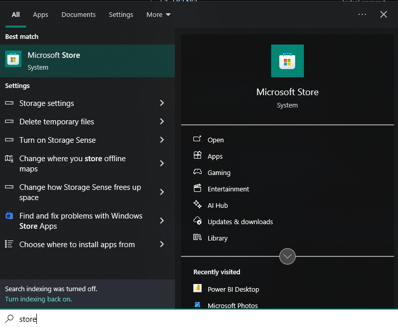
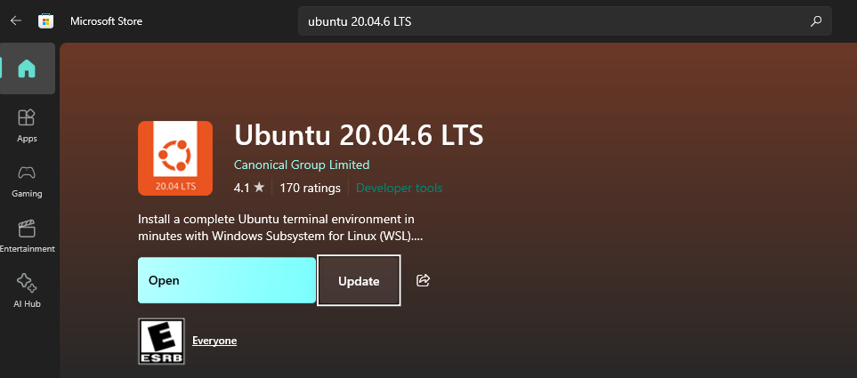
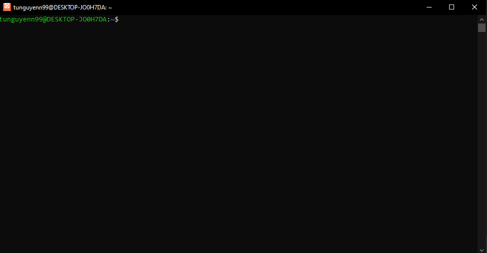
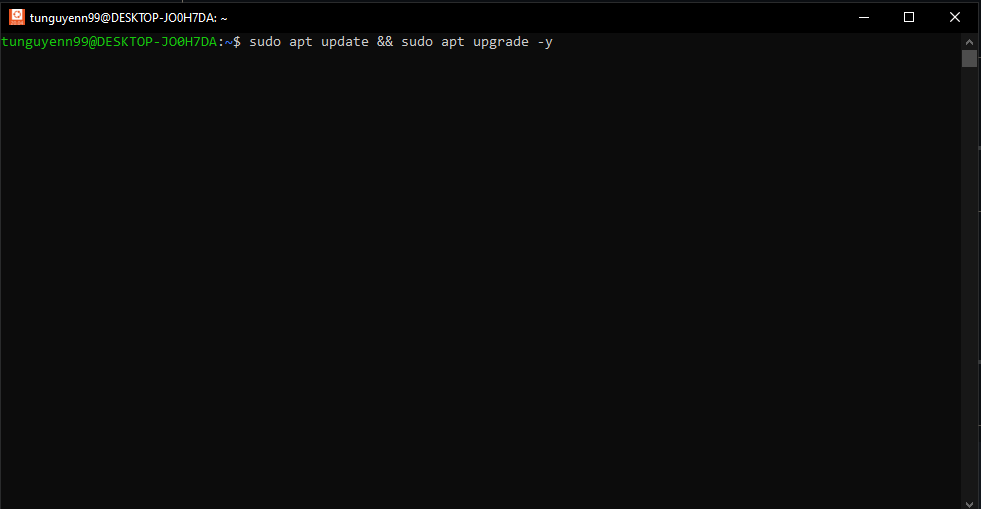

# 🐧 Cài đặt Ubuntu trên Windows

> Link Youtube: https://youtu.be/UX_0pw0nMmY

> Cài đặt Ubuntu 20.04 LTS trên Windows (WSL) và thiết lập môi trường Python + Git để phát triển

## 🔧 Yêu cầu trước khi cài đặt

- Windows 10/11 đã bật **WSL (Windows Subsystem for Linux)**  
  Hướng dẫn bật WSL: [Xem tại đây](https://learn.microsoft.com/en-us/windows/wsl/install)

---

## 1️⃣ Cài đặt Ubuntu 20.04 từ Microsoft Store

### Bước 1: Tìm kiếm Microsoft Store



### Bước 2: Tìm kiếm và cài đặt Ubuntu 20.04 LTS



### Bước 3: Khởi chạy Ubuntu lần đầu từ Start Menu


---

## 2️⃣ Thiết lập Ubuntu

Sau khi mở Ubuntu lần đầu, giao diện sẽ như sau:



Bạn sẽ được yêu cầu tạo username và password

---

## 3️⃣ Cập nhật hệ thống và cài Python

Chạy các lệnh sau:

```bash
sudo apt update && sudo apt upgrade -y
sudo apt install python3 python3-pip python3-venv -y
```

Ví dụ:



---

## 4️⃣ Tạo môi trường ảo Python

```bash
python3 -m venv venv
source venv/bin/activate
```

> ✅ Lúc này bạn đã vào môi trường `venv` (dấu `(venv)` sẽ hiển thị ở đầu dòng terminal)

---

## 5️⃣ Cài đặt Git và cấu hình SSH

### 🔹 Cài Git

```bash
sudo apt install git -y
```

### 🔹 Thiết lập Git

```bash
git config --global user.name "Tên của bạn"
git config --global user.email "email@example.com"
```

### 🔹 Tạo SSH key

```bash
ssh-keygen -t ed25519 -C "email@example.com"
cat ~/.ssh/id_ed25519.pub
```

> Kết quả giống như hình minh hoạ dưới đây:


Copy SSH key để thêm vào GitHub (Settings → SSH and GPG Keys → New SSH Key)

---

## 6️⃣ Cài đặt VS Code (tuỳ chọn nhưng khuyến nghị)

> Bạn nên cài [Visual Studio Code](https://code.visualstudio.com/) bản Windows. Sau khi mở VS Code, cài extension `Remote - WSL` để làm việc trực tiếp với Ubuntu.

---

## 🎉 Hoàn tất!

Giờ bạn đã có một môi trường Ubuntu + Python + Git đầy đủ để phát triển các project cá nhân 🎯

---

## 📁 Thư mục này để làm gì?

Bạn có thể dùng repo này làm nơi chứa các script khởi tạo, hướng dẫn hoặc cấu hình mở rộng (như Docker, NodeJS, DBT...) trong quá trình học và làm việc với Ubuntu trên WSL.
